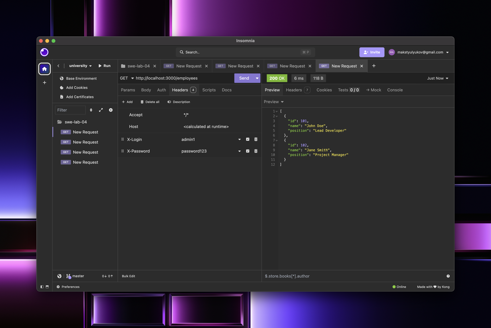
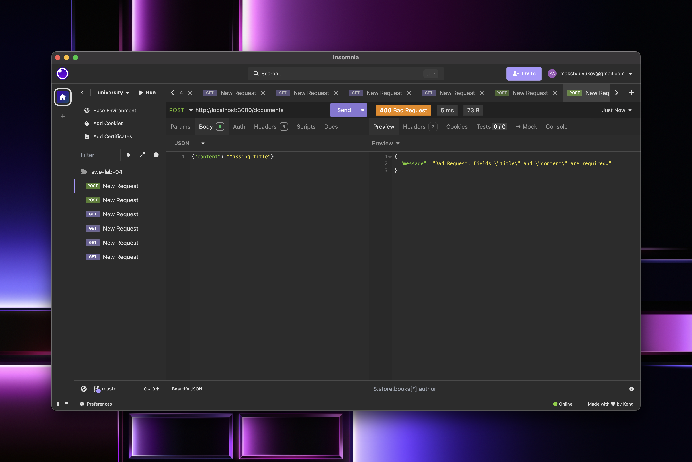
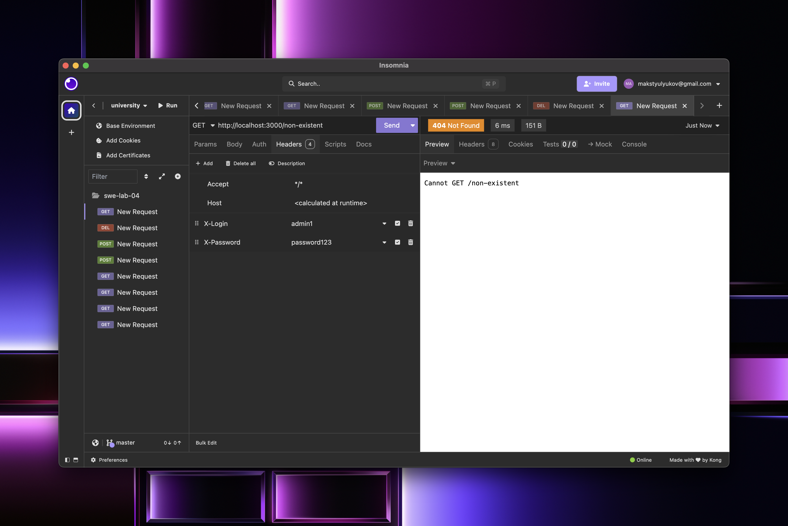

# Secure API Lab

A secure REST API built with Node.js and Express, implementing authentication, role-based authorization, and request logging middleware.

This API manages documents and employees resources. Access to documents requires authentication, while access to employee data is restricted to administrators only.

## Installation

```bash
npm install
```

## Running the Server

```bash
npm start
```

The server will start at `http://localhost:3000`.

## Running Tests

```bash
npm test
```

Make sure the server is running before executing tests.

## API Endpoints

| Method   | URL              | Description                  | Auth Required | Admin Only | Request Body                                      | Response Codes                    |
|----------|------------------|------------------------------|---------------|------------|---------------------------------------------------|-----------------------------------|
| `GET`    | `/documents`     | Get all documents            | Yes           | No         | -                                                 | `200 OK`, `401 Unauthorized`      |
| `POST`   | `/documents`     | Create a new document        | Yes           | No         | `{ "title": "...", "content": "..." }`            | `201 Created`, `400 Bad Request`, `401 Unauthorized` |
| `DELETE` | `/documents/:id` | Delete a document by ID      | Yes           | No         | -                                                 | `204 No Content`, `404 Not Found`, `401 Unauthorized` |
| `GET`    | `/employees`     | Get all employees            | Yes           | Yes        | -                                                 | `200 OK`, `401 Unauthorized`, `403 Forbidden` |

## Authentication

Include the following headers in your requests:

- `X-Login`: User login (e.g., `user1` or `admin1`)
- `X-Password`: User password (e.g., `password123`)

### Available Users

| Login   | Password      | Role  |
|---------|---------------|-------|
| user1   | password123   | user  |
| admin1  | password123   | admin |

## Screenshots

### 1. GET /documents without authentication → 401 Unauthorized


### 2. GET /employees as user → 403 Forbidden


### 3. GET /documents as user → 200 OK


### 4. GET /employees as admin → 200 OK


### 5. POST /documents with valid body → 201 Created


### 6. POST /documents with missing fields → 400 Bad Request


### 7. DELETE /documents/1 → 204 No Content


### 8. GET /non-existent route → 404 Not Found


### 9. Test client output

